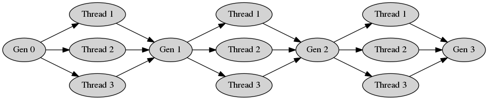
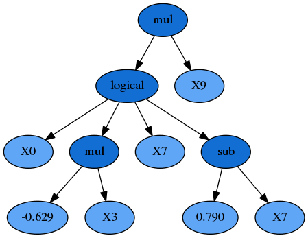

.. _advanced:

Advanced Use
============

.. currentmodule:: gplearn.genetic

.. _introspection:

Introspecting Programs
----------------------

If you wish to learn more about how the evolution process came to the final
solution, ``gplearn`` provides several means to examine the best programs and
their parents. Most of these methods are illustrated
:ref:`in the examples section <example>`.

Each of :class:`SymbolicRegressor`, :class:`SymbolicClassifier` and
:class:`SymbolicTransformer` overload the ``print`` function to output a
LISP-style flattened tree representation of the program. Simply ``print(est)``
the fitted estimator and the program will be output to your session.

If you would like to see more details about the final programs, you can access
the underlying ``_Program`` objects which contains several attributes and
methods that can yield more information about them.

:class:`SymbolicRegressor` and :class:`SymbolicClassifier` have a private
attribute ``_program`` which is a single ``_Program`` object that was the
fittest program found in the final generation of the evolution.

:class:`SymbolicTransformer` on the other hand has a private attribute
``_best_programs`` which is a list of ``_Program`` objects of length
``n_components`` being the least-correlated and fittest programs found in the
final generation of the evolution. :class:`SymbolicTransformer` is also
iterable so you can loop through the estimator itself to access each underlying
``_Program`` object.

Each ``_Program`` object can also be printed as with the estimator themselves
to get a readable representation of the programs. They also have several
attributes that you can use to further understand the programs:

    - ``raw_fitness_`` : The raw fitness of the individual program.
    - ``fitness_`` : The penalized fitness of the individual program.
    - ``oob_fitness_`` : The out-of-bag raw fitness of the individual program
      for the held-out samples. Only present when sub-sampling was used in the
      estimator by specifying ``max_samples`` < 1.0.
    - ``depth_`` : The maximum depth of the program tree.
    - ``length_`` : The number of functions and terminals in the program.

For example with a :class:`SymbolicTransformer`::

    for program in est_gp:
        print(program)
        print(program.raw_fitness_)

        div(div(X11, X12), X10)
        0.840099070652
        sub(div(mul(X4, X12), div(X9, X9)), sub(div(X11, X12), add(X12, X0)))
        0.814627147552

Or if you want to access the individual programs::

    print(est_gp._best_programs[0])

    div(div(X11, X12), X10)

And for a :class:`SymbolicRegressor`::

    print(est_gp)
    print(est_gp._program)
    print(est_gp._program.raw_fitness_)

    add(sub(add(X5, div(X5, 0.388)), X0), div(add(X5, X10), X12))
    add(sub(add(X5, div(X5, 0.388)), X0), div(add(X5, X10), X12))
    4.88966783112

You can also plot the programs as a program tree using Graphviz via the
``export_graphviz`` method of the ``_Program`` objects. In a Jupyter notebook
this is easy using the ``pydotplus`` package::

    from IPython.display import Image
    import pydotplus
    graph = est_gp._program.export_graphviz()
    graph = pydotplus.graphviz.graph_from_dot_data(graph)
    Image(graph.create_png())

This assumes you are satisfied with only seeing the final results, but the
relevant programs that led to the final solutions are still retained in the
estimator's ``_programs`` attribute. This object is a list of lists of all of
the ``_Program`` objects that were involved in the evolution of the solution.
The first entry in the outer list is the original naive generation of programs
while the last entry is the final generation in which the solutions were found.

Note that any programs in earlier generations that were discarded through the
selection process are replaced with ``None`` objects to conserve memory.

Each of the programs in the final solution and the generations that preceded
them have a attribute called ``parents``. Except for the naive programs from
the initial population who have a ``parents`` value of ``None``, this
dictionary contains information about how that program was evolved. Its
contents differ depending on the genetic operation that was performed on its
parents to yield that program:

    - Crossover:
        - 'method': 'Crossover'
        - 'parent_idx': The index of the parent program in the previous
          generation.
        - 'parent_nodes': The indices of the nodes in the subtree in the
          parent program that was replaced.
        - 'donor_idx': The index of the donor program in the previous
          generation.
        - 'donor_nodes': The indices of the nodes in the subtree in the
          donor program that was donated to the parent.
    - Subtree Mutation:
        - 'method': 'Subtree Mutation'
        - 'parent_idx': The index of the parent program in the previous
          generation.
        - 'parent_nodes': The indices of the nodes in the subtree in the
          parent program that was replaced.
    - Hoist Mutation:
        - 'method': 'Hoist Mutation'
        - 'parent_idx': The index of the parent program in the previous
          generation.
        - 'parent_nodes': The indices of the nodes in the parent program that
          were removed.
    - Point Mutation:
        - 'method': 'Point Mutation'
        - 'parent_idx': The index of the parent program in the previous
          generation.
        - 'parent_nodes': The indices of the nodes in the parent program that
          were replaced.
    - Reproduction:
        - 'method': 'Reproduction'
        - 'parent_idx': The index of the parent program in the previous
          generation.
        - 'parent_nodes': An empty list as nothing was changed.

The ``export_graphviz`` also has an optional parameter ``fade_nodes`` which
can take a list of nodes that should be shown as being altered in the
visualization. For example if the best program had this parent::

    print(est_gp._program.parents)

    {'parent_idx': 75, 'parent_nodes': [1, 10], 'method': 'Point Mutation'}

You could plot its parent with the affected nodes indicated using::

    idx = est_gp._program.parents['parent_idx']
    fade_nodes = est_gp._program.parents['parent_nodes']
    print(est_gp._programs[-2][idx])
    graph = est_gp._programs[-2][idx].export_graphviz(fade_nodes=fade_nodes)
    graph = pydotplus.graphviz.graph_from_dot_data(graph)
    Image(graph.create_png())

.. _parallel:

Running Evolution in Parallel
-----------------------------

It is easy to run your evolution parallel. All you need to do is to change
the ``n_jobs`` parameter in :class:`SymbolicRegressor`,
:class:`SymbolicClassifier` or :class:`SymbolicTransformer`. Whether this will
reduce your run times depends a great deal upon the problem you are working on.

Genetic programming is inherently an iterative process. One generation
undergoes genetic operations with other members of the same generation in order
to produce the next. When ran in parallel, gplearn splits the genetic
operations into equal-sized batches that run in parallel, but the generations
themselves must be completed before the next step can begin. For example, with
three threads and three generations the processing would look like this:

Until all of the computation in Threads 1, 2 & 3 have completed, the next
generation must wait for them all to complete.

Spinning up all these extra processes in parallel is not free. There is a
substantial overhead in running `gplearn` in parallel and because of the
iterative nature of evolution one should test whether there is any advantage
from doing so for your problem. In many cases the overhead of creating extra
processes will exceed the savings of running in parallel.

In general large populations or large programs can benefit from parallel
processing. If you have small populations and keep your programs small however,
you may actually have your runs go faster on a single thread!

.. currentmodule:: gplearn

.. _export:

Exporting
---------

If you want to save your program for later use, you can use the ``pickle``
library to achieve this::

    import pickle

    est = SymbolicRegressor()
    est.fit(X_train, y_train)

Optionally, you can reduce the file size of the pickled object by removing the
evolution information contained within the ``_programs`` attribute. Note though
that while the resulting estimator will be able to do predictions, doing this
will remove the ability to use ``warm_start`` to continue the evolution, or
inspection of the final solution's parents::

    delattr(est, '_programs')

Then simply dump your model to a file::

    with open('gp_model.pkl', 'wb') as f:
        pickle.dump(est, f)

You can then load it at another date easily::

    with open('gp_model.pkl', 'rb') as f:
        est = pickle.load(f)

And use it as if it was the Python session where you originally trained the
model.

.. _custom_functions:

Custom Functions
----------------

This example demonstrates modifying the function set with your own user-defined
functions using the :func:`functions.make_function()` factory function.

First you need to define some function which will return a numpy array of the
correct shape. Most numpy operations will automatically do this. The factory
will perform some basic checks on your function to ensure it complies with
this. The function must also protect against zero division and invalid floating
point operations (such as the log of a negative number).

For this example we will implement a logical operation where two arguments are
compared, and if the first one is larger, return a third value, otherwise
return a fourth value::

    def _logical(x1, x2, x3, x4):
        return np.where(x1 > x2, x3, x4)

To make this into a ``gplearn`` compatible function, we use the factory where
we must give it a name for display purposes and declare the arity of the
function which must match the number of arguments that your function expects::

    logical = make_function(function=_logical,
                            name='logical',
                            arity=4)

Due to the way that the default Python pickler works, by default ``gplearn``
wraps your function to be serialised with cloudpickle. This can mean your
evolution will run slightly more slowly. If you have no need to export your
model after the run, or you are running single-threaded in an interactive
Python session you may achieve a faster evolution time by setting the optional
parameter ``wrap=False`` in :func:`functions.make_function()`.

This can then be added to a ``gplearn`` estimator like so::

    gp = SymbolicTransformer(function_set=['add', 'sub', 'mul', 'div', logical])

**Note that custom functions should be specified as the function object name
(ie. with no quotes), while built-in functions use the name of the function as
a string.**

After fitting, you will see some of your programs will have used your own
customized functions, for example::

    sub(logical(X6, add(X11, 0.898), X10, X2), X5)

In other mathematical relationships, it may be necessary to ensure the function
has :ref:`closure <closure>`. This means that the function will always return a
valid floating point result. Using ``np.where``, the user can protect against
invalid operations and substitute problematic values with a default such as 0
or 1. One example is the built-in protected division function where infinite
values resulting by divide by zero are replaced by 1::

    def _protected_division(x1, x2):
        with np.errstate(divide='ignore', invalid='ignore'):
            return np.where(np.abs(x2) > 0.001, np.divide(x1, x2), 1.)

Or a custom function where floating-point overflow is protected in an
exponential function::

    def _protected_exponent(x1):
        with np.errstate(over='ignore'):
            return np.where(np.abs(x1) < 100, np.exp(x), 0.)

For further information on the types of errors that numpy can encounter and
what you will need to protect against in your own custom functions, see
`here <https://docs.scipy.org/doc/numpy-1.13.0/reference/generated/numpy.seterr.html#numpy.seterr>`_.

.. _custom_fitness:

Custom Fitness
--------------

You can easily create your own fitness measure to have your programs evolve to
optimize whatever metric you need. This is done using the
:func:`fitness.make_fitness()` factory function. Let's say we wish to measure
our programs using MAPE (mean absolute percentage error). First we would need
to implement a function that returns this value. The function must take the
arguments ``y`` (the actual target values), ``y_pred`` (the predicted values
from the program) and ``w`` (the weights to apply to each sample) to work. For
MAPE, a possible solution is::

    def _mape(y, y_pred, w):
        """Calculate the mean absolute percentage error."""
        diffs = np.abs(np.divide((np.maximum(0.001, y) - np.maximum(0.001, y_pred)),
                                 np.maximum(0.001, y)))
        return 100. * np.average(diffs, weights=w)

Division by zero must be protected for a metric like MAPE as it is generally
used for cases where the target is positive and non-zero (like forecasting
demand). We need to keep in mind that the programs begin by being totally
naive, so a negative return value is possible. The ``np.maximum`` function will
protect against these cases, though you may wish to treat this differently
depending on your specific use case.

We then create a fitness measure for use in our evolution by using the
:func:`fitness.make_fitness()` factory function as follows::

    mape = make_fitness(_mape, greater_is_better=False)

This fitness measure can now be used to evolve a program that optimizes for
your specific needs by passing the new fitness object to the ``metric`` parameter
when creating an estimator::

    est = SymbolicRegressor(metric=mape, verbose=1)

As with custom functions, by default ``gplearn`` wraps your fitness metric to
be serialised with cloudpickle. If you have no need to export your model after
the run, or you are running single-threaded in an interactive Python session
you may achieve a faster evolution time by setting the optional parameter
``wrap=False`` in :func:`fitness.make_fitness()`.

.. currentmodule:: gplearn.genetic

.. _warm_start:

Continuing Evolution
--------------------

If you are evolving a lot of generations in your training session, but find
that you need to keep evolving more, you can use the ``warm_start`` parameter in
both :class:`SymbolicRegressor` and :class:`SymbolicTransformer` to continue
evolution beyond your original estimates. To do so, start evolution as usual::

    est = SymbolicRegressor(generations=10)
    est.fit(X, y)

If you then need to add further generations, simply change the ``generations``
and ``warm_start`` attributes and fit again::

    est.set_params(generations=20, warm_start=True)
    est.fit(X, y)

Evolution will then continue for a further 10 generations without losing the
programs that had been previously trained.
