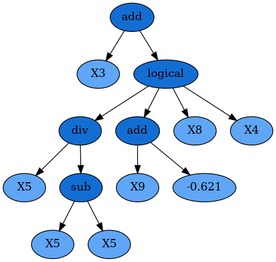

.. _advanced:

Advanced Use
============

.. currentmodule:: gplearn.genetic

.. _introspection:

Introspecting Programs
----------------------

If you wish to learn more about how the evolution process came to the final
solution, ``gplearn`` provides several means to examine the best programs and
their parents. Most of these methods are illustrated
:ref:`in the examples section <example>`.

Both :class:`SymbolicRegressor` and :class:`SymbolicTransformer` overload the
`print` function to output a LISP-style flattened tree representation of the
program. Simply `print` the fitted estimator and the program will be output to
your session.

.. currentmodule:: gplearn

.. _export:

Exporting
---------

If you want to save your program for later use, you can use the ``pickle`` or
``cPickle`` libraries to achieve this::

    import cPickle as pickle

    est = SymbolicRegressor()
    est.fit(X_train, y_train)

Simply dump your model to a file::

    with open('gp_model.pkl', 'wb') as f:
        pickle.dump(est, f)

You can then load it at another date easily::

    with open('gp_model.pkl', 'rb') as f:
        est_gp = pickle.load(f)

And use it as if it was the Python session where you originally trained the
model.

.. _custom_functions:

Custom Functions
----------------

This example demonstrates modifying the function set with your own user-defined
functions using the :func:`functions.make_function()` factory function.

First you need to define some function which will return a numpy array of the
correct shape. Most numpy operations will automatically do this. The factory
will perform some basic checks on your function to ensure it complies with
this. The function must also protect against zero division and invalid floating
point operations (such as the log of a negative number).

For this example we will implement a logical operation where two arguments are
compared, and if the first one is larger, return a third value, otherwise
return a fourth value::

    def _logical(x1, x2, x3, x4):
        return np.where(x1 > x2, x3, x4)

To make this into a ``gplearn`` compatible function, we use the factory where
we must give it a name for display purposes and declare the arity of the
function which must match the number of arguments that your function expects::

    logical = make_function(function=_logical,
                            name='logical',
                            arity=4)

This can then be added to a ``gplearn`` estimator like so::

    gp = SymbolicTransformer(function_set=['add', 'sub', 'mul', 'div', logical])

**Note that custom functions should be specified as the function object name
(ie. with no quotes), while built-in functions use the name of the function as
a string.**

After fitting, you will see some of your programs will have used your own
customized functions, for example::

    sub(logical(X6, add(X11, 0.898), X10, X2), X5)

In other mathematical relationships, it may be necessary to ensure the function
has :ref:`closure <closure>`. This means that the function will always return a
valid floating point result. Using ``np.where``, the user can protect against
invalid operations and substitute problematic values with a default such as 0
or 1. One example is the built-in protected division function where infinite
values resulting by divide by zero are replaced by 1::

    def _protected_division(x1, x2):
        with np.errstate(divide='ignore', invalid='ignore'):
            return np.where(np.abs(x2) > 0.001, np.divide(x1, x2), 1.)

Or a custom function where floating-point overflow is protected in an
exponential function::

    def _protected_exponent(x1):
        with np.errstate(over='ignore'):
            return np.where(np.abs(x1) < 100, np.exp(x), 0.)

For further information on the types of errors that numpy can encounter and
what you will need to protect against in your own custom functions, see
`here <https://docs.scipy.org/doc/numpy-1.13.0/reference/generated/numpy.seterr.html#numpy.seterr>`_.

.. _custom_fitness:

Custom Fitness
--------------

You can easily create your own fitness measure to have your programs evolve to
optimize whatever metric you need. This is done using the
:func:`fitness.make_fitness()` factory function. Let's say we wish to measure
our programs using MAPE (mean absolute percentage error). First we would need
to implement a function that returns this value. The function must take the
arguments ``y`` (the actual target values), ``y_pred`` (the predicted values
from the program) and ``w`` (the weights to apply to each sample) to work. For
MAPE, a possible solution is::

    def _mape(y, y_pred, w):
        """Calculate the mean absolute percentage error."""
        diffs = np.abs(np.divide((np.maximum(0.001, y) - np.maximum(0.001, y_pred)),
                                 np.maximum(0.001, y)))
        return 100. * np.average(diffs, weights=w)

Division by zero must be protected for a metric like MAPE as it is generally
used for cases where the target is positive and non-zero (like forecasting
demand). We need to keep in mind that the programs begin by being totally
naive, so a negative return value is possible. The ``np.maximum`` function will
protect against these cases, though you may wish to treat this differently
depending on your specific use case.

We then create a fitness measure for use in our evolution by using the
:func:`fitness.make_fitness()` factory function as follows::

    mape = make_fitness(_mape, greater_is_better=False)

This fitness measure can now be used to evolve a program that optimizes for
your specific needs by passing the new fitness object to the ``metric`` parameter
when creating an estimator::

    est = SymbolicRegressor(metric=mape, verbose=1)

.. currentmodule:: gplearn.genetic

.. _warm_start:

Continuing Evolution
--------------------

If you are evolving a lot of generations in your training session, but find
that you need to keep evolving more, you can use the ``warm_start`` parameter in
both :class:`SymbolicRegressor` and :class:`SymbolicTransformer` to continue
evolution beyond your original estimates. To do so, start evolution as usual::

    est = SymbolicRegressor(generations=10)
    est.fit(X, y)

If you then need to add further generations, simply change the ``generations``
and ``warm_start`` attributes and fit again::

    est.set_params(generations=20, warm_start=True)
    est.fit(X, y)

Evolution will then continue for a further 10 generations without losing the
programs that had been previously trained.
