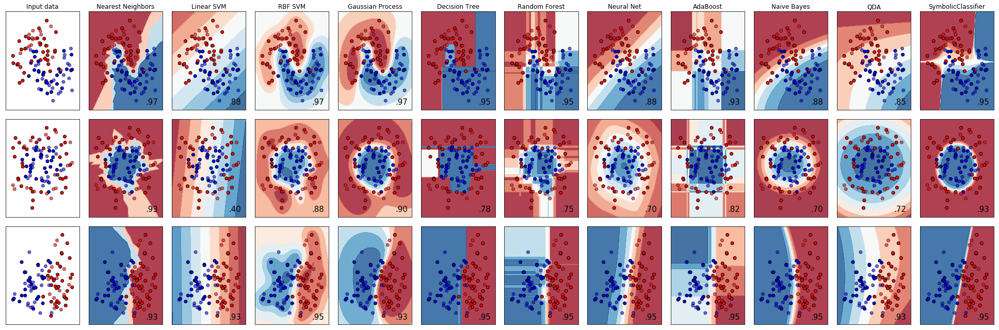
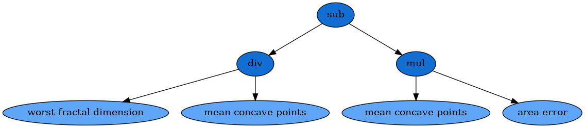

.. _example:

Examples
========

The code used to generate these examples can be
`found here <https://github.com/trevorstephens/gplearn/blob/master/doc/gp_examples.ipynb>`_
as an iPython Notebook.

.. currentmodule:: gplearn.genetic

Symbolic Regressor
------------------

This example demonstrates using the :class:`SymbolicRegressor` to fit a
symbolic relationship.

Let's create some synthetic data based on the relationship
:math:`y = X_0^{2} - X_1^{2} + X_1 - 1`::

    x0 = np.arange(-1, 1, 1/10.)
    x1 = np.arange(-1, 1, 1/10.)
    x0, x1 = np.meshgrid(x0, x1)
    y_truth = x0**2 - x1**2 + x1 - 1

    ax = plt.figure().gca(projection='3d')
    ax.set_xlim(-1, 1)
    ax.set_ylim(-1, 1)
    surf = ax.plot_surface(x0, x1, y_truth, rstride=1, cstride=1,
                           color='green', alpha=0.5)
    plt.show()

.. image:: images/ex1_fig1.png
    :align: center

We can create some random training and test data that lies on this surface too::

    rng = check_random_state(0)

    # Training samples
    X_train = rng.uniform(-1, 1, 100).reshape(50, 2)
    y_train = X_train[:, 0]**2 - X_train[:, 1]**2 + X_train[:, 1] - 1

    # Testing samples
    X_test = rng.uniform(-1, 1, 100).reshape(50, 2)
    y_test = X_test[:, 0]**2 - X_test[:, 1]**2 + X_test[:, 1] - 1

Now let's consider how to fit our :class:`SymbolicRegressor` to this data.
Since it's a fairly small dataset, we can probably use a large population since
training time will still be pretty fast. We'll evolve 20 generations unless the
error falls below 0.01. Examining the equation, it looks like the default
function set of addition, subtraction, multiplication and division will cover
us. Let's bump up the amount of mutation and subsample so that we can watch
the OOB error evolve. We'll also increase the parsimony coefficient to keep our
solutions small, since we know the truth is a pretty simple equation::

    est_gp = SymbolicRegressor(population_size=5000,
                               generations=20, stopping_criteria=0.01,
                               p_crossover=0.7, p_subtree_mutation=0.1,
                               p_hoist_mutation=0.05, p_point_mutation=0.1,
                               max_samples=0.9, verbose=1,
                               parsimony_coefficient=0.01, random_state=0)
    est_gp.fit(X_train, y_train)

        |    Population Average   |             Best Individual              |
    ---- ------------------------- ------------------------------------------ ----------
     Gen   Length          Fitness   Length          Fitness      OOB Fitness  Time Left
       0    38.13     458.57768152        5   0.320665972828   0.556763539274      1.28m
       1     9.97    1.70232723129        5   0.320201761523   0.624787148042     57.78s
       2     7.72    1.94456344674       11   0.239536660154   0.533148180489     46.35s
       3     5.41   0.990156815469        7   0.235676349446   0.719906258051     37.93s
       4     4.66   0.894443363616       11   0.103946413589   0.103946413589     32.20s
       5     5.41   0.940242380405       11   0.060802040427   0.060802040427     28.15s
       6     6.78     1.0953592564       11   0.000781474035   0.000781474035     24.85s

The evolution process stopped early as the error of the best program in the 9th
generation was better than 0.01. It also appears that the parsimony coefficient
was just about right as the average length of the programs fluctuated around a
bit before settling on a pretty reasonable size. Let's look at what our
solution was::

    print(est_gp._program)
    
    sub(add(-0.999, X1), mul(sub(X1, X0), add(X0, X1)))

Interestingly, this does not have the same structure as our target function.
But let's expand the mathematics out:

.. math::
    y = (-0.999 + X_1) - ((X_1 - X_0) \times (X_0 + X_1))

.. math::
    y = X_1 - 0.999 - (X_1 X_0 + X_1^{2} - X_0^{2} - X_0 X_1)

.. math::
    y = X_0^{2} - X_1^{2} + X_1 - 0.999

Despite representing an interaction of :math:`X_0` and :math:`X_1`, these terms
cancel and we're left with the (almost) exact relationship we were seeking!

Great, but let's compare with some other non-linear models to see how they do::

    est_tree = DecisionTreeRegressor()
    est_tree.fit(X_train, y_train)
    est_rf = RandomForestRegressor()
    est_rf.fit(X_train, y_train)

We can plot the decision surfaces of all three to visualize each one::

    y_gp = est_gp.predict(np.c_[x0.ravel(), x1.ravel()]).reshape(x0.shape)
    score_gp = est_gp.score(X_test, y_test)
    y_tree = est_tree.predict(np.c_[x0.ravel(), x1.ravel()]).reshape(x0.shape)
    score_tree = est_tree.score(X_test, y_test)
    y_rf = est_rf.predict(np.c_[x0.ravel(), x1.ravel()]).reshape(x0.shape)
    score_rf = est_rf.score(X_test, y_test)

    fig = plt.figure(figsize=(12, 10))

    for i, (y, score, title) in enumerate([(y_truth, None, "Ground Truth"),
                                           (y_gp, score_gp, "SymbolicRegressor"),
                                           (y_tree, score_tree, "DecisionTreeRegressor"),
                                           (y_rf, score_rf, "RandomForestRegressor")]):

        ax = fig.add_subplot(2, 2, i+1, projection='3d')
        ax.set_xlim(-1, 1)
        ax.set_ylim(-1, 1)
        surf = ax.plot_surface(x0, x1, y, rstride=1, cstride=1, color='green', alpha=0.5)
        points = ax.scatter(X_train[:, 0], X_train[:, 1], y_train)
        if score is not None:
            score = ax.text(-.7, 1, .2, "$R^2 =\/ %.6f$" % score, 'x', fontsize=14)
        plt.title(title)
    plt.show()

.. image:: images/ex1_fig2.png
    :align: center

Not bad :class:`SymbolicRegressor`! We were able to fit a very smooth function
to the data, while the tree-based estimators created very "blocky" decision
surfaces. The Random Forest appears to have smoothed out some of the wrinkles
but in both cases the tree models have fit very well to the training data, but
done worse on out-of-sample data.

We can also inspect the program that the :class:`SymbolicRegressor` found::

    dot_data = est_gp._program.export_graphviz()
    graph = graphviz.Source(dot_data)
    graph

.. image:: images/ex1_child.png
    :align: center

And check out who its parents were::

    print(est_gp._program.parents)

    {'method': 'Crossover',
     'parent_idx': 1555,
     'parent_nodes': [1, 2, 3],
     'donor_idx': 78,
     'donor_nodes': []}

This dictionary tells us what evolution operation was performed to get our new
individual, as well as the parents from the prior generation, and any nodes
that were removed from them during, in this case, Crossover.

Plotting the parents shows how the genetic material from them combined to form
our winning program::

    idx = est_gp._program.parents['donor_idx']
    fade_nodes = est_gp._program.parents['donor_nodes']
    dot_data = est_gp._programs[-2][idx].export_graphviz(fade_nodes=fade_nodes)
    graph = graphviz.Source(dot_data)
    graph

.. image:: images/ex1_fig3.png
    :align: center

Symbolic Transformer
--------------------

This example demonstrates using the :class:`SymbolicTransformer` to generate
new non-linear features automatically.

Let's load up the Boston housing dataset and randomly shuffle it::

    rng = check_random_state(0)
    boston = load_boston()
    perm = rng.permutation(boston.target.size)
    boston.data = boston.data[perm]
    boston.target = boston.target[perm]

We'll use Ridge Regression for this example and train our regressor on the
first 300 samples, and see how it performs on the unseen final 200 samples. The
benchmark to beat is simply Ridge running on the dataset as-is::

    est = Ridge()
    est.fit(boston.data[:300, :], boston.target[:300])
    print(est.score(boston.data[300:, :], boston.target[300:]))
    
    0.759145222183

So now we'll train our transformer on the same first 300 samples to generate
some new features. Let's use a large population of 2000 individuals over 20
generations. We'll select the best 100 of these for the ``hall_of_fame``, and
then use the least-correlated 10 as our new features. A little parsimony should
control bloat, but we'll leave the rest of the evolution options at their
defaults. The default ``metric='pearson'`` is appropriate here since we are
using a linear model as the estimator. If we were going to use a tree-based
estimator, the Spearman correlation might be interesting to try out too::

    function_set = ['add', 'sub', 'mul', 'div',
                    'sqrt', 'log', 'abs', 'neg', 'inv',
                    'max', 'min']
    gp = SymbolicTransformer(generations=20, population_size=2000,
                             hall_of_fame=100, n_components=10,
                             function_set=function_set,
                             parsimony_coefficient=0.0005,
                             max_samples=0.9, verbose=1,
                             random_state=0, n_jobs=3)
    gp.fit(boston.data[:300, :], boston.target[:300])

We will then apply our trained transformer to the entire Boston dataset
(remember, it still hasn't seen the final 200 samples) and concatenate this to
the original data::

    gp_features = gp.transform(boston.data)
    new_boston = np.hstack((boston.data, gp_features))

Now we train the Ridge regressor on the first 300 samples of the transformed
dataset and see how it performs on the final 200 again::

    est = Ridge()
    est.fit(new_boston[:300, :], boston.target[:300])
    print(est.score(new_boston[300:, :], boston.target[300:]))
    
    0.841750404385

Great! We have improved the :math:`R^{2}` score by a significant margin. It
looks like the linear model was able to take advantage of some new non-linear
features to fit the data even better.

Symbolic Classifier
-------------------

Continuing the scikit-learn `classifier comparison <https://scikit-learn.org/stable/auto_examples/classification/plot_classifier_comparison.html>`_
example to include the :class:`SymbolicClassifier` we can see what types of
decision boundaries could be found using genetic programming.

As we can see, the :class:`SymbolicClassifier` was able to find non-linear
decision boundaries. Individual tweaks to the function sets and other
parameters to better suit each dataset may also improve the fits.

As with scikit-learn's disclaimer, this should be taken with a grain of salt
for use with real-world datasets in multi-dimensional spaces. In order to look
at that, let's load the Wisconsin breast cancer dataset and shuffle it::

    rng = check_random_state(0)
    cancer = load_breast_cancer()
    perm = rng.permutation(cancer.target.size)
    cancer.data = cancer.data[perm]
    cancer.target = cancer.target[perm]

We will use the base function sets and increase the parsimony in order to find
a small solution to the problem, and fit to the first 400 samples::

    est = SymbolicClassifier(parsimony_coefficient=.01,
                             feature_names=cancer.feature_names,
                             random_state=1)
    est.fit(cancer.data[:400], cancer.target[:400])

Testing the estimator on the remaining samples shows that it found a very good
solution::

    y_true = cancer.target[400:]
    y_score = est.predict_proba(cancer.data[400:])[:,1]
    roc_auc_score(y_true, y_score)

    0.96937869822485212

We can then also visualise the solution with Graphviz::

    dot_data = est._program.export_graphviz()
    graph = graphviz.Source(dot_data)
    graph

It is important to note that the results of this formula are passed through the
sigmoid function in order to transform the solution into class probabilities.

Next up, :ref:`explore the full API reference <reference>` or just skip ahead
:ref:`install the package <installation>`!