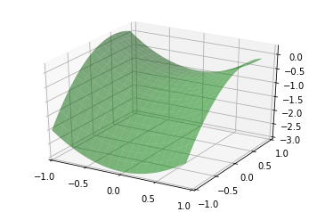
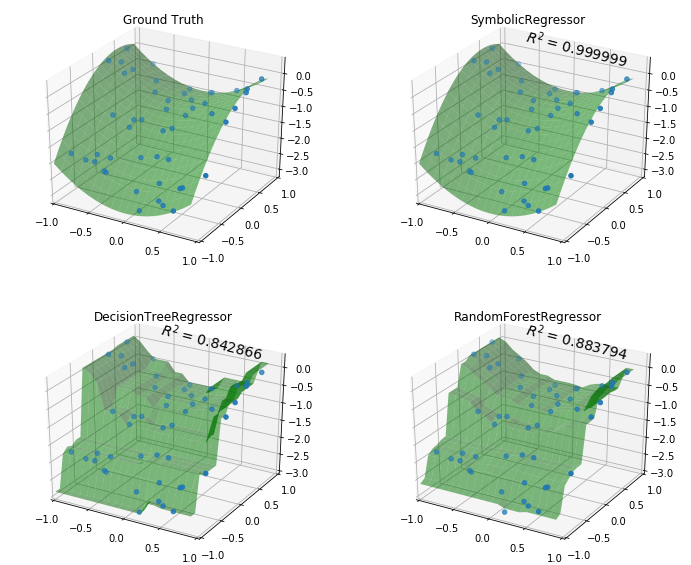
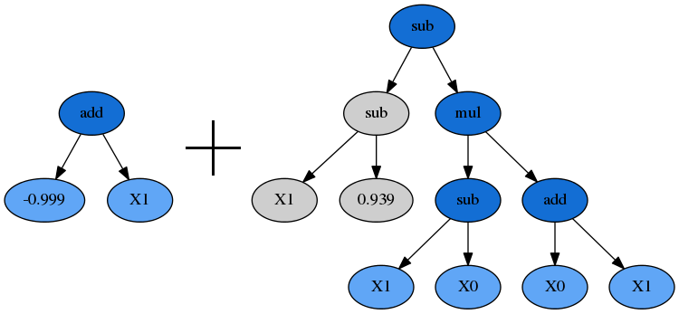

.. _example:

Examples
========

The code used to generate these examples can be
`found here <http://nbviewer.ipython.org/github/trevorstephens/gplearn/blob/master/doc/gp_examples.ipynb>`_
as an iPython Notebook.

.. currentmodule:: gplearn.genetic

Example 1: Symbolic Regressor
-----------------------------

This example demonstrates using the :class:`SymbolicRegressor` to fit a
symbolic relationship.

Let's create some synthetic data based on the relationship
:math:`y = X_0^{2} - X_1^{2} + X_1 - 1`::

    x0 = np.arange(-1, 1, 1/10.)
    x1 = np.arange(-1, 1, 1/10.)
    x0, x1 = np.meshgrid(x0, x1)
    y_truth = x0**2 - x1**2 + x1 - 1

    ax = plt.figure().gca(projection='3d')
    ax.set_xlim(-1, 1)
    ax.set_ylim(-1, 1)
    surf = ax.plot_surface(x0, x1, y_truth, rstride=1, cstride=1,
                           color='green', alpha=0.5)
    plt.show()

We can create some random training and test data that lies on this surface too::

    rng = check_random_state(0)

    # Training samples
    X_train = rng.uniform(-1, 1, 100).reshape(50, 2)
    y_train = X_train[:, 0]**2 - X_train[:, 1]**2 + X_train[:, 1] - 1

    # Testing samples
    X_test = rng.uniform(-1, 1, 100).reshape(50, 2)
    y_test = X_test[:, 0]**2 - X_test[:, 1]**2 + X_test[:, 1] - 1

Now let's consider how to fit our :class:`SymbolicRegressor` to this data.
Since it's a fairly small dataset, we can probably use a large population since
training time will still be pretty fast. We'll evolve 20 generations unless the
error falls below 0.01. Examining the equation, it looks like the default
function set of addition, subtraction, multiplication and division will cover
us. Let's bump up the amount of mutation and subsample so that we can watch
the OOB error evolve. We'll also increase the parsimony coefficient to keep our
solutions small, since we know the truth is a pretty simple equation::

    est_gp = SymbolicRegressor(population_size=5000,
                               generations=20, stopping_criteria=0.01,
                               p_crossover=0.7, p_subtree_mutation=0.1,
                               p_hoist_mutation=0.05, p_point_mutation=0.1,
                               max_samples=0.9, verbose=1,
                               parsimony_coefficient=0.01, random_state=0)
    est_gp.fit(X_train, y_train)

        |    Population Average   |             Best Individual              |
    ---- ------------------------- ------------------------------------------ ----------
     Gen   Length          Fitness   Length          Fitness      OOB Fitness  Time Left
       0    38.13     386.19117972        7   0.331580808730   0.470286152255     55.15s
       1     9.91    1.66832489614        5   0.335361761359   0.488347149514      1.25m
       2     7.76      1.888657267        7   0.260765934398   0.565517599814      1.45m
       3     5.37    1.00018638338       17   0.223753461954   0.274920433701      1.42m
       4     4.69   0.878161643513       17   0.145095322600   0.158359554221      1.35m
       5      6.1    0.91987274474       11   0.043612562970   0.043612562970      1.31m
       6     7.18    1.09868887802       11   0.043612562970   0.043612562970      1.23m
       7     7.65    1.96650325011       11   0.043612562970   0.043612562970      1.18m
       8     8.02    1.02643443398       11   0.043612562970   0.043612562970      1.08m
       9     9.07    1.22732144371       11   0.000781474035  0.0007814740353     59.43s

The evolution process stopped early as the error of the best program in the 9th
generation was better than 0.01. It also appears that the parsimony coefficient
was just about right as the average length of the programs fluctuated around a
bit before settling on a pretty reasonable size. Let's look at what our
solution was::

    print est_gp._program
    
    sub(add(-0.999, X1), mul(sub(X1, X0), add(X0, X1)))

Interestingly, this does not have the same structure as our target function.
But let's expand the mathematics out:

.. math::
    y = (-0.999 + X_1) - ((X_1 - X_0) \times (X_0 + X_1))

.. math::
    y = X_1 - 0.999 - (X_1 X_0 + X_1^{2} - X_0^{2} - X_0 X_1)

.. math::
    y = X_0^{2} - X_1^{2} + X_1 - 0.999

Despite representing an interaction of :math:`X_0` and :math:`X_1`, these terms
cancel and we're left with the (almost) exact relationship we were seeking!

Great, but let's compare with some other non-linear models to see how they do::

    est_tree = DecisionTreeRegressor()
    est_tree.fit(X_train, y_train)
    est_rf = RandomForestRegressor()
    est_rf.fit(X_train, y_train)

We can plot the decision surfaces of all three to visualize each one::

    y_gp = est_gp.predict(np.c_[x0.ravel(), x1.ravel()]).reshape(x0.shape)
    score_gp = est_gp.score(X_test, y_test)
    y_tree = est_tree.predict(np.c_[x0.ravel(), x1.ravel()]).reshape(x0.shape)
    score_tree = est_tree.score(X_test, y_test)
    y_rf = est_rf.predict(np.c_[x0.ravel(), x1.ravel()]).reshape(x0.shape)
    score_rf = est_rf.score(X_test, y_test)

    fig = plt.figure(figsize=(12, 10))

    for i, (y, score, title) in enumerate([(y_truth, None, "Ground Truth"),
                                           (y_gp, score_gp, "SymbolicRegressor"),
                                           (y_tree, score_tree, "DecisionTreeRegressor"),
                                           (y_rf, score_rf, "RandomForestRegressor")]):

        ax = fig.add_subplot(2, 2, i+1, projection='3d')
        ax.set_xlim(-1, 1)
        ax.set_ylim(-1, 1)
        surf = ax.plot_surface(x0, x1, y, rstride=1, cstride=1, color='green', alpha=0.5)
        points = ax.scatter(X_train[:, 0], X_train[:, 1], y_train)
        if score is not None:
            score = ax.text(-.7, 1, .2, "$R^2 =\/ %.6f$" % score, 'x', fontsize=14)
        plt.title(title)
    plt.show()

Not bad :class:`SymbolicRegressor`! We were able to fit a very smooth function
to the data, while the tree-based estimators created very "blocky" decision
surfaces. The Random Forest appears to have smoothed out some of the wrinkles
but in both cases the tree models have fit very well to the training data, but
done worse on out-of-sample data.

We can also inspect the program that the :class:`SymbolicRegressor` found::

    graph = pydotplus.graphviz.graph_from_dot_data(est_gp._program.export_graphviz())
    Image(graph.create_png())

.. image:: images/ex1_child.png
    :align: center

And check out who its parents were::

    print est_gp._program.parents
    
    {'method': 'Crossover',
     'parent_idx': 374,
     'parent_nodes': [1, 2, 3],
     'donor_idx': 116,
     'donor_nodes': [0, 1, 2, 6]}

This dictionary tells us what evolution operation was performed to get our new
individual, as well as the parents from the prior generation, and any nodes
that were removed from them during, in this case, Crossover.

Plotting the parents shows how the genetic material from them combined to form
our winning program::

    idx = est_gp._program.parents['donor_idx']
    fade_nodes = est_gp._program.parents['donor_nodes']
    graph = est_gp._programs[-2][idx].export_graphviz(fade_nodes=fade_nodes)
    graph = pydotplus.graphviz.graph_from_dot_data(graph)
    Image(graph.create_png())

Example 2: Symbolic Transformer
-------------------------------

This example demonstrates using the :class:`SymbolicTransformer` to generate
new non-linear features automatically.

Let's load up the Boston housing dataset and randomly shuffle it::

    rng = check_random_state(0)
    boston = load_boston()
    perm = rng.permutation(boston.target.size)
    boston.data = boston.data[perm]
    boston.target = boston.target[perm]

We'll use Ridge Regression for this example and train our regressor on the
first 300 samples, and see how it performs on the unseen final 200 samples. The
benchmark to beat is simply Ridge running on the dataset as-is::

    est = Ridge()
    est.fit(boston.data[:300, :], boston.target[:300])
    print est.score(boston.data[300:, :], boston.target[300:])
    
    0.759145222183

So now we'll train our transformer on the same first 300 samples to generate
some new features. Let's use a large population of 2000 individuals over 20
generations. We'll select the best 100 of these for the ``hall_of_fame``, and
then use the least-correlated 10 as our new features. A little parsimony should
control bloat, but we'll leave the rest of the evolution options at their
defaults. The default ``metric='pearson'`` is appropriate here since we are
using a linear model as the estimator. If we were going to use a tree-based
estimator, the Spearman correlation might be interesting to try out too::

    function_set = ['add', 'sub', 'mul', 'div',
                    'sqrt', 'log', 'abs', 'neg', 'inv',
                    'max', 'min']
    gp = SymbolicTransformer(generations=20, population_size=2000,
                             hall_of_fame=100, n_components=10,
                             function_set=function_set,
                             parsimony_coefficient=0.0005,
                             max_samples=0.9, verbose=1,
                             random_state=0, n_jobs=3)
    gp.fit(boston.data[:300, :], boston.target[:300])

We will then apply our trained transformer to the entire Boston dataset
(remember, it still hasn't seen the final 200 samples) and concatenate this to
the original data::

    gp_features = gp.transform(boston.data)
    new_boston = np.hstack((boston.data, gp_features))

Now we train the Ridge regressor on the first 300 samples of the transformed
dataset and see how it performs on the final 200 again::

    est = Ridge()
    est.fit(new_boston[:300, :], boston.target[:300])
    print est.score(new_boston[300:, :], boston.target[300:])
    
    0.853618353633

Great! We have improved the :math:`R^{2}` score by a significant margin. It
looks like the linear model was able to take advantage of some new non-linear
features to fit the data even better.

.. currentmodule:: gplearn

Example 3: Customizing Your Programs
------------------------------------

This example demonstrates modifying the function set with your own user-defined
functions using the :func:`functions.make_function()` factory function.

First you need to define some function which will return a numpy array of the
correct shape. Most numpy operations will automatically do this. The factory
will perform some basic checks on your function to ensure it complies with
this. The function must also protect against zero division and invalid floating
point operations (such as the log of a negative number).

For this example we will implement a logical operation where two arguments are
compared, and if the first one is larger, return a third value, otherwise
return a fourth value:

    def logic(x1, x2, x3, x4):
        return np.where(x1 > x2, x3, x4)

To make this into a ``gplearn`` compatible function, we use the factory where
we must give it a name for display purposes and declare the arity of the
function which must match the number of arguments that your function expects:

    logical = make_function(function=logic,
                            name='logical',
                            arity=4)

This can then be added to a ``gplearn`` estimator like so:

    gp = SymbolicTransformer(function_set=['add', 'sub', 'mul', 'div', logical])

After fitting, you will see some of your programs will have used your own
customized functions, for example:

    mul(logical(X0, mul(-0.629, X3), X7, sub(0.790, X7)), X9)

.. image:: images/ex3_fig1.png
    :align: center

Example 4: Customizing Your Fitness Measure
-------------------------------------------

You can easily create your own fitness measure to have your programs evolve to
optimize whatever metric you need. This is done using the
:func:`fitness.make_fitness()` factory function. Let's say we wish to measure
our programs using MAPE (mean absolute percentage error). First we would need
to implement a function that returns this value. The function must take the
arguments `y` (the actual target values), `y_pred` (the predicted values from
the program) and `w` (the weights to apply to each sample) to work. For MAPE, a
possible solution is:

    def _mape(y, y_pred, w):
        """Calculate the mean absolute percentage error."""
        diffs = np.abs(np.divide((np.maximum(0.001, y) - np.maximum(0.001, y_pred)),
                                 np.maximum(0.001, y)))
        return 100. * np.average(diffs, weights=w)

Division by zero must be protected for a metric like MAPE as it is generally
used for cases where the target is positive and non-zero (like forecasting
demand). We need to keep in mind that the programs begin by being totally
naive, so a negative return value is possible. The `np.maximum` function will
protect against these cases, though you may wish to treat this differently
depending on your specific use case.

We then create a fitness measure for use in our evolution by using the
:func:`fitness.make_fitness()` factory function as follows:

    mape = make_fitness(_mape, greater_is_better=False)

This fitness measure can now be used to evolve a program that optimizes for
your specific needs by passing the new fitness object to the `metric` parameter
when creating an estimator:

    est = SymbolicRegressor(metric=mape, verbose=1)

Next up, :ref:`explore the full API reference <reference>` or just skip ahead
:ref:`install the package <installation>`!
