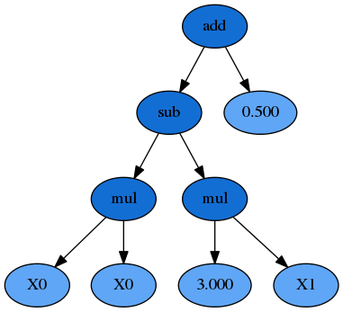
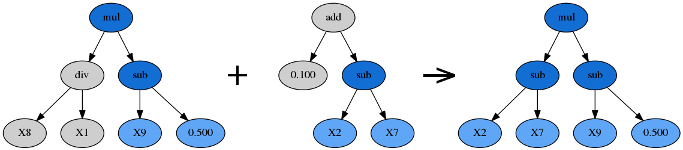
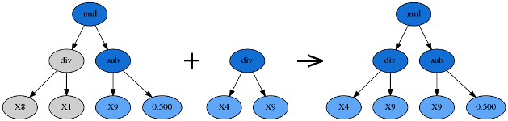
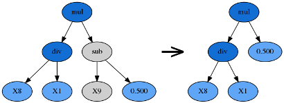
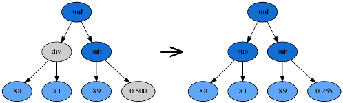

.. _intro:

Introduction to GP
==================

|

.. image:: logos/gplearn-wide.png
    :align: center

|

.. math::
    Owing \,to \,this \,struggle \,for \,life,

.. math::
     any \,variation, \,however \,slight \,and \,from \,whatever \,cause \,proceeding,

.. math::
    if \,it \,be \,in \,any \,degree \,profitable \,to \,an \,individual \,of \,any \,species,

.. math::
    in \,its \,infinitely \,complex \,relations \,to \,other \,organic \,beings \,and \,to \,external \,nature,

.. math::
    will \,tend \,to \,the \,preservation \,of \,that \,individual,

.. math::
    and \,will \,generally \,be \,inherited \,by \,its \,offspring.

.. math::
    - \,Charles \,Darwin, \,On \,the \,Origin \,of \,Species \,(1859)

|
|

.. currentmodule:: gplearn.genetic

``gplearn`` extends the `scikit-learn <http://scikit-learn.org>`_ machine
learning library to perform Genetic Programming (GP) with symbolic regression.

Symbolic regression is a machine learning technique that aims to identify an
underlying mathematical expression that best describes a relationship. It
begins by building a population of naive random formulas to represent a
relationship between known independent variables and their dependent variable
targets in order to predict new data. Each successive generation of programs
is then evolved from the one that came before it by selecting the fittest
individuals from the population to undergo genetic operations.

Genetic programming is capable of taking a series of totally random programs,
untrained and unaware of any given target function you might have had in mind,
and making them breed, mutate and evolve their way towards the truth.

Think of genetic programming as a stochastic optimization process. Every time
an initial population is conceived, and with every selection and evolution step
in the process, random individuals from the current generation are selected to
undergo random changes in order to enter the next. You can control this
randomness by using the ``random_state`` parameter of the estimator.

So you're skeptical. I hope so. Read on and discover the ways that the fittest
programs in the population interact with one another to yield an even better
generation.

.. _representation:

Representation
--------------

As mentioned already, GP seeks to find a mathematical formula to represent a
relationship. Let's use an arbitrary relationship as an example for the
different ways that this could be written. Say we have two variables X0 and X1
that interact as follows to define a dependent variable y:

.. math::
    y = X_0^{2} - 3 \times X_1 + 0.5

This could be re-written as:

.. math::
    y = X_0 \times X_0 - 3 \times X_1 + 0.5

Or as a LISP symbolic expression (S-expression) representation which uses
prefix-notation, and happens to be very common in GP, as:

.. math::
    y = (+ (- (\times X_0 X_0) (\times 3 X_1)) 0.5)

Or, since we're working in python here, let's express this as a numpy formula::

    y = np.add(np.subtract(np.multiply(X0, X0), np.multiply(3., X1)), 0.5)

In each of these representations, we have a mix of variables, constants and
functions. In this case we have the functions addition, subtraction, and
multiplication. We also have the variables :math:`X_0` and :math:`X_1` and
constants 3.0 and 0.5. Collectively, the variables and constants are known as
terminals. Combined with the functions, the collection of available variables,
constants and functions are known as the primitive set.

We could also represent this formula as a syntax tree, where the functions are
interior nodes, shown in dark blue, and the variables and constants make up the
leaves (or terminal nodes), shown in light blue:

Now you can see that the formula can be interpreted in a recursive manner. If
we start with the left-hand leaves, we multiply :math:`X_0` and :math:`X_0` and
that portion of the formula is evaluated by the subtraction operation (once the
:math:`X_1 \times 3.0` portion is also evaluated). The result of the
subtraction is then evaluated by the addition operation as we work up the
syntax tree.

Importantly for GP the :math:`X_0 \times X_0` sub-expression, or sub-tree, can
be replaced by any other valid expression that evaluates to a numerical answer,
even if that is a constant. That sub-expression, and any larger one such as
everything below the subtraction function, all reside adjacent to one another
in the list-style representation, making replacement of these segments simple
to do programatically.

A function has a property known as its arity. Arity, in a python functional
sense, refers to the number of arguments that the function takes. In the cases
above, all of the functions require two arguments, and thus have an arity of
two. But other functions such as ``np.abs()``, only require a single argument,
and have an arity of 1.

Since we know the arity of all the available functions in our function set, we
can actually simplify the S-expression and remove all of the parentheses:

.. math::
    y = + - \times X_0 X_0 \times 3 X_1 0.5

This could then be evaluated recursively, starting from the left and holding
onto a stack which keeps track of how much cumulative arity needs to be
satisfied by the terminal nodes.

Under the hood, ``gplearn``'s representation is similar to this, and uses Python
lists to store the functions and terminals. Constants are represented by
floating point numbers, variables by integers and functions by a custom
``Function`` object.

In ``gplearn``, the available function set is controlled by an argument that
is set when initializing an estimator. The default set is the arithmetic
operators: addition, subtraction, division and multiplication. But you can also
add in some transformers, comparison functions or trigonometric functions that
are all built-in. These strings are put into the ``function_set`` argument to
include them in your programs.

    - 'add' : addition, arity=2.
    - 'sub' : subtraction, arity=2.
    - 'mul' : multiplication, arity=2.
    - 'div' : division, arity=2.
    - 'sqrt' : square root, arity=1.
    - 'log' : log, arity=1.
    - 'abs' : absolute value, arity=1.
    - 'neg' : negative, arity=1.
    - 'inv' : inverse, arity=1.
    - 'max' : maximum, arity=2.
    - 'min' : minimum, arity=2.
    - 'sin' : sine (radians), arity=1.
    - 'cos' : cosine (radians), arity=1.
    - 'tan' : tangent (radians), arity=1.

You should chose whether these functions are valid for your program.

.. currentmodule:: gplearn

You can also set up your own functions by using the :func:`functions.make_function`
factory function which will create a gp-compatible function node that can be
incorporated into your programs. See
:ref:`advanced use here <custom_functions>`.

.. currentmodule:: gplearn.genetic

.. _fitness:

Fitness
-------

Now that we can represent a formula as an executable program, we need to
determine how well it performs. In a throwback to Darwin, in GP this measure is
called a program's fitness. If you have used machine learning before, you may
be more familiar with terms such as “score”, “error” or “loss”. It's basically
the same thing, and as with those other machine learning terms, in GP we have
to know whether the metric needs to be maximized or minimized in order to be
able to select the best program in a group.

In ``gplearn``, several metrics are available by setting the ``metric``
parameter.

For the :class:`SymbolicRegressor` several common error metrics are available
and the evolution process seeks to minimize them. The default is the magnitude
of the error, 'mean absolute error'. Other metrics available are:

    - 'mse' for mean squared error, and
    - 'rmse' for root mean squared error.

For the :class:`SymbolicTransformer`, where indirect optimization is sought,
the metrics are based on correlation between the program's output and the
target, these are maximized by the evolution process:

    - 'pearson', for Pearson's product-moment correlation coefficient (the
      default), and
    - 'spearman' for Spearman's rank-order correlation coefficient.

These two correlation metrics are also supported by the
:class:`SymbolicRegressor`, though their output will not directly predict the
target; they are better used as a value-added feature to a second-stage
estimator. Both will equally prefer strongly positively or negatively
correlated predictions.

The :class:`SymbolicClassifier` currently uses the 'log loss' aka binary
cross-entropy loss as its default metric to optimise.

.. currentmodule:: gplearn

You can also set up your own fitness measures by using the
:func:`fitness.make_fitness` factory function which will create a
gp-compatible fitness function that can be used to evaluate your programs. See
:ref:`advanced use here <custom_fitness>`.

Evaluating the fitness of all the programs in a population is probably the most
expensive part of GP. In ``gplearn``, you can parallelize this computation by
using the ``n_jobs`` parameter to choose how many cores should work on it at
once. If your dataset is small, the overhead of splitting the work over several
cores is probably more than the benefit of the reduced work per core. This is
because the work is parallelized per generation, so use this only if your
dataset is large and the fitness calculation takes a long time.

.. _closure:

Closure
-------

We have already discussed that the measure of a program's fitness is through
some function that evaluates the program's predictions compared to some ground
truth. But with functions like division in the function set, what happens if
your denominator happens to be close to zero? In the case of zero division, or
near-zero division in a computer program, the result happens to be an infinite
quantity. So there goes your error for the entire test set, even if all other
fitness samples were evaluated almost perfectly!

Thus, a critical component of rugged GP becomes apparent: we need to protect
against such cases for functions that might break for certain arguments.
Functions like division must be modified to be able to accept any input
argument and still return a valid number at evaluation so that
nodes higher up the tree can successfully evaluate their output.

In ``gplearn``, several protected functions are used:

    - division, if the denominator lies between -0.001 and 0.001, returns
      1.0.
    - square root returns the square root of the absolute value of the
      argument.
    - log returns the logarithm of the absolute value of the argument, or
      for very small values less than 0.001, it returns 0.0.
    - inverse, if the argument lies between -0.001 and 0.001, returns 0.0.

In this way, no matter the value of the input data or structure of the evolved
program, a valid numerical output can be guaranteed, even if we must sacrifice
some interpretability to get there.

If you define your own functions, you will need to guard for this as well. The
:func:`functions.make_function` factory function will perform some basic checks
on your function to ensure it will guard against the most common invalid
operations with negative or near-zero operations.

.. _sufficiency:

Sufficiency
-----------

Another requirement of a successful GP run is called sufficiency. Basically,
can this problem be solved to an adequate degree with the functions and
variables available (i.e., are the functions and inputs *sufficient* for
the given problem).

For toy symbolic regression tasks, like that solved in example 1, this is easy
to ascertain. But in real life, things are less easy to quantify. It may be
that there is a good solution lurking in the given multi-dimensional space, but
there were insufficient generations evolved, or bad luck turned the evolution
process in the wrong direction. It may also be possible that no good
relationship can be found through symbolic combinations of your variables.

In practice, try to set the constant range to a value that will be helpful
to get close to the target. For example, if you are trying to regress on a
target with values from 500 – 1000 using variables in a range of 0 – 1, a
constant of 0.5 is unlikely to help, and the “best” solution is probably just
going to be large amounts of irrelevant additions to try and get close to the
lower bound. Similarly, `standardizing <http://scikit-learn.org/stable/modules/generated/sklearn.preprocessing.scale.html>`_
or `scaling <http://scikit-learn.org/stable/modules/generated/sklearn.preprocessing.MinMaxScaler.html>`_
your variables and targets can make the problem much easier to learn in some
cases.

If you are using trigonometric functions, make sure all angles are measured in
radians and that these functions are useful for your problem. (Do you
expect inputs to have a periodic or oscillatory effect on the target?
Perhaps temporal variables have a seasonal effect?)

If you think that the problem requires a very large formula to solve,
start with a larger program depth. And if your dataset has many variables, 
perhaps the “full” initialization method (initializing the population with
full-size programs) makes more sense than waiting for programs to grow
large enough to make use of all variables.

.. _initilization:

Initialization
--------------

When starting a GP run, the first generation is blissfully unaware that there
is any fitness function that needs to be maximized. These naive
programs are a random mix of the available functions and variables and will
generally perform poorly. But the user might be able to "strengthen" the 
initial population by providing good initialization parameters. While these
parameters may be of some help, bear in mind that one of the most significant
factors impacting performance is the number of features in your dataset.

The first parameter to look at is the ``init_depth`` of the programs in the
first generation. ``init_depth`` is a tuple of two integers which specify
the range of initial depths that the first generation of programs can have.
(Though, depending on the ``init_method`` used, first generation programs
may be smaller than this range specifies; see below for more information.)
Each program in the first generation is randomly assigned a depth from this
range, and this range *only applies to the first generation*. The default range
of 2 – 6 is generally a good starting point, but if your dataset has many
variables, you may want to shift the range to the right so that the first
generation contains larger programs.

Next, you should consider ``population_size``. This controls the number of
programs competing in the first generation and every generation thereafter.
If you have very few variables, and have a limited function set,
a smaller population size may suffice. If you have a lot of variables, or
expect a very large program is required, you may want to start with a larger
population. More likely, the number of programs you wish to maintain will be
constrained by the amount of time you want to spend evaluating them.

Finally, you need to decide on the ``init_method`` appropriate for your data.
This can be one of ``'grow'``, ``'full'``, or ``'half and half'``. For all
options, the root node must be a function (as opposed to a variable or a
constant).

For the ``'grow'`` method, nodes are chosen at random from both functions and
terminals, allowing for smaller trees than ``init_depth`` specifies. This tends
to grow asymmetrical trees as terminals can be chosen before the max depth is
reached. If your dataset has a lot of variables, this will likely result in
*much smaller* programs than ``init_depth``  specifies. Similarly, if you
have very few variables and have chosen a large function set, you will likely
see programs approaching the maximum depth specified by ``init_depth``.

The ``'full'`` method chooses nodes from the function set until the max depth is
reached, and then terminals are chosen. This tends to grow "bushy", symmetrical
trees.

The default is the ``'half and half'`` method. Program trees are grown through a
50/50 mix of ``'full'`` and ``'grow'`` (i.e., half the population has 
``init_method`` set to ``'full'``, and the other half is set to ``'grow'``). 
This makes for a mix of tree shapes in the initial population. 

.. _selection:

Selection
---------

Now that we have a population of programs, we need to decide which ones will
get to evolve into the next generation. In ``gplearn`` this is done through
tournaments. From the population, a smaller subset is selected at random to
compete, the size of which is controlled by the ``tournament_size`` parameter.
The fittest individual in this subset is then selected to move on to the next
generation.

Having a large tournament size will generally find fitter programs more quickly
and the evolution process will tend to converge to a solution in less time. A
smaller tournament size will likely maintain more diversity in the population
as more programs are given a chance to evolve and the population may find a
better solution at the expense of taking longer. This is known as selection
pressure, and your choice here may be governed by the computation time.

.. _evolution:

Evolution
---------

As discussed in the selection section, we use the fitness measure to find the
fittest individual in the tournament to survive. But this individual does not
just graduate unaltered to the next generation: first, genetic operations are
performed on them. Several common genetic operations are supported by
``gplearn``.

**Crossover**

Crossover is the principle method of mixing genetic material between
individuals and is controlled by the ``p_crossover`` parameter. Unlike other
genetic operations, it requires two tournaments to be run in order to find a
parent and a donor.

Crossover takes the winner of a tournament and selects a random subtree from it
to be replaced. A second tournament is performed to find a donor. The donor
also has a subtree selected at random and this is inserted into the original
parent to form an offspring in the next generation.

**Subtree Mutation**

Subtree mutation is one of the more aggressive mutation operations and is
controlled by the ``p_subtree_mutation`` parameter. The reason it is more
aggressive is that more genetic material can be replaced by totally naive
random components. This can reintroduce extinct functions and operators into the
population to maintain diversity.

Subtree mutation takes the winner of a tournament and selects a random subtree
from it to be replaced. A donor subtree is generated at random and this is
inserted into the parent to form an offspring in the next generation.

**Hoist Mutation**

Hoist mutation is a bloat-fighting mutation operation. It is controlled by the
``p_hoist_mutation`` parameter. The sole purpose of this mutation is to remove
genetic material from tournament winners.

Hoist mutation takes the winner of a tournament and selects a random subtree
from it. A random subtree of that subtree is then selected and this is
"hoisted" into the original subtree's location to form an offspring in the next
generation.

**Point Mutation**

Point mutation is probably the most common form of mutation in
genetic programming. Like subtree mutation, it can also reintroduce extinct
functions and operators into the population to maintain diversity.

Point mutation takes the winner of a tournament and selects random nodes from
it to be replaced. Terminals are replaced by other terminals and functions are
replaced by other functions that require the same number of arguments as the
original node. The resulting tree forms an offspring in the next generation.

Functions and terminals are randomly chosen for replacement as controlled by
the ``p_point_replace`` parameter which guides the average amount of replacement
to perform.

**Reproduction**

Should the sum of the above genetic operations' probabilities be less than one,
the balance of genetic operations shall fall back on reproduction. That is, a
tournament winner is cloned and enters the next generation unmodified.

.. _termination:

Termination
-----------

There are two ways that the evolution process will stop. The first is that the
maximum number of generations, controlled by the parameter ``generations``, is
reached. The second way is that at least one program in the population has a
fitness that exceeds the parameter ``stopping_criteria``, which defaults to
being a perfect score. You may need to do a couple of test runs to determine
what metric is possible if you are working with real-life data in order to set
this value appropriately.

.. _bloat:

Bloat
-----

A program's size can be measured in two ways: its depth and length. The depth
of a program is the distance from its root node to the furthest leaf
node. A degenerative program with only a single value (i.e., y = X0) has a depth
of zero. The length of a program is the number of elements in the
formula which is equal to the total number of nodes.

An interesting phenomenon is often encountered in GP where the program sizes
grow larger and larger with no significant improvement in fitness. This is
known as bloat and leads to longer and longer computation times with little
benefit to the solution.

Bloat can be fought in ``gplearn`` in several ways. The principle weapon is
using a penalized fitness measure during selection where the fitness of an
individual is made worse the larger it is. In this way, should there be two
programs with identical fitness competing in a tournament, the smaller program
will be selected and the larger one discarded. The ``parsimony_coefficient``
parameter controls this penalty and may need to be experimented with to get
good performance. Too large a penalty and your smallest programs will tend to
be selected regardless of their actual performance on the data, too small and
bloat will continue unabated. The final winner of the evolution process is
still chosen based on the unpenalized fitness, otherwise known as its raw
fitness.

A recent paper introduced the covariant parsimony method which can be used by
setting ``parsimony_coefficient='auto'``. This method adapts the penalty
depending on the relationship between program fitness and size in the
population and will change from generation to generation.

Another method to fight bloat is by using genetic operations that make programs
smaller. ``gplearn`` provides hoist mutation which removes parts of programs
during evolution. It can be controlled by the  ``p_hoist_mutation`` parameter.

Finally, you can increase the amount of subsampling performed on your data to
get more diverse looks at individual programs from smaller portions of the
data. ``max_samples`` controls this rate and defaults to no subsampling. As a
bonus, if you choose to subsample, you also get to see the “out of bag” fitness
of the best program in the verbose reporter (activated by setting
``verbose=1``). Hopefully this is pretty close to the in-sample fitness that is
also reported.

.. currentmodule:: gplearn.genetic

.. _classification:

Classification
--------------

The :class:`SymbolicClassifier` works in exactly the same way as the
:class:`SymbolicRegressor` in how the evolution takes place. The only
difference is that the output of the program is transformed through a
`sigmoid function <https://en.wikipedia.org/wiki/Sigmoid_function>`_ in order
to transform the numeric output into probabilities of each class. In essence
this means that a negative output of a function means that the program is
predicting one class, and a positive output predicts the other.

Note that the sigmoid function is not considered when evaluating the depth or
length of the program, ie. the size of the programs and thus the behaviour of
bloat reduction measures are equivalent to those in the regressor.

.. _transformer:

Transformer
-----------

The :class:`SymbolicTransformer` works slightly differently to the
:class:`SymbolicRegressor`. While the regressor seeks to minimize the error
between the programs' outputs and the target variable based on an error metric,
the transformer seeks an indirect relationship that can then be exploited by a
second estimator. Essentially, this is automated feature engineering and can
create powerful non-linear interactions that may be difficult to discover in
conventional methods.

Where the regressor looks to minimize the direct error, the transformer looks
to maximize the correlation between the predicted value and the target. This is
done through either the Pearson product-moment correlation coefficient (the
default) or the Spearman rank-order correlation coefficient. In both cases the
absolute value of the correlation is maximized in order to accept strongly
negatively correlated programs.

The Spearman correlation is appropriate if your next estimator is going to be
tree-based, such as a Random Forest or Gradient Boosting Machine. If
you plan to send the new transformed variables into a linear model, it is
probably better to stick with the default Pearson correlation.

The :class:`SymbolicTransformer` looks at the final generation of the evolution
and picks the best programs to evaluate. The number of programs it will look at
is controlled by the ``hall_of_fame`` parameter.

From the hall of fame, it will then whittle down the best programs to the least
correlated amongst them as controlled by the ``n_components`` parameter. You
may have the top two programs being almost identical, so this step removes that
issue. The correlation between individuals within the hall of fame uses the
same correlation method, Pearson or Spearman, as used by the evolution process.

Convinced?

:ref:`See some examples <example>`,
:ref:`explore the full API reference <reference>` and
:ref:`install the package <installation>`!
